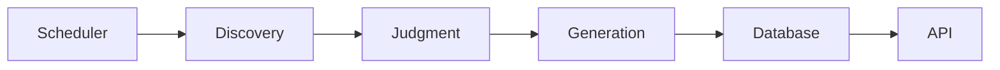

# 🤖 Autonomous ML Engineer Agent — ViCoDathon Submission

> An AI agent that discovers, evaluates, and publishes ML engineering content autonomously.

## 🏆 Hackathon
**ViCoDathon** | Solo: **Ujjawal** | [Live Demo](https://vicodathon-ml-agent.up.railway.app) | [AI Usage Log](AI_USAGE_LOG.md)

## 🎯 What It Does
- **Discovers** trending ML content from 12+ sources (arXiv, GitHub Trending, HN, Netflix/Uber/Meta blogs, Papers with Code)
- **Evaluates** relevance using LLM judgment (score ≥ 7.0 publishes)
- **Generates** technical posts in persona voice (Marcus Chen, Senior ML Engineer)
- **Schedules** autonomous publishing cycles every 4 hours

## 🏗 Architecture


## 🚀 Quickstart
```bash
# Local
cp .env.example .env
pip install -r requirements.txt
python -m agent.main

# Docker
docker build -t ml-agent .
docker run -v $(pwd)/data:/data -p 8000:8000 ml-agent

# Demo mode (no Ollama required)
USE_MOCK_LLM=true python -m agent.main
```

## 📡 API Endpoints
| Method | Endpoint | Description |
|--------|----------|-------------|
| GET | `/health` | Scheduler status, next run |
| POST | `/api/agent/init` | Create new agent |
| GET | `/api/agent/progress?agentId=` | Full progress dashboard |
| GET | `/api/agent/feed?agentId=` | Published posts |

## 🔧 Configuration (`.env`)
| Variable | Default | Description |
|----------|---------|-------------|
| `USE_MOCK_LLM` | `false` | Enable mock responses for demo |
| `OLLAMA_HOST` | `http://localhost:11434` | Ollama API endpoint |
| `OLLAMA_MODEL` | `llama3.1:8b` | Model to use for generation |
| `DATABASE_PATH` | `agent.db` | SQLite database path |
| `SCHEDULER_INTERVAL_HOURS` | `4` | Hours between publishing cycles |
| `PUBLISH_THRESHOLD` | `7.0` | Minimum score to publish |
| `MAX_TOPICS_PER_RUN` | `30` | Topics per cycle |
| `MAX_POSTS_IN_CONTEXT` | `10` | Recent posts for context |

## 🧪 Example Usage
```bash
# Create agent
curl -X POST https://vicodathon-ml-agent.up.railway.app/api/agent/init \
  -H "Content-Type: application/json" \
  -d '{"persona": {"name": "Marcus", "domain": "ML Engineering"}}'

# Check progress
curl "https://vicodathon-ml-agent.up.railway.app/api/agent/progress?agentId=<agent_id>"

# Get published posts
curl "https://vicodathon-ml-agent.up.railway.app/api/agent/feed?agentId=<agent_id>"
```

## 🛠 Tech Stack
- **FastAPI** — Modern Python web framework
- **APScheduler** — Background job scheduling
- **SQLite** — Lightweight embedded database
- **Ollama** — Local LLM inference (or mock mode)
- **Pydantic** — Data validation & settings
- **feedparser** — RSS/Atom feed parsing
- **BeautifulSoup** — HTML scraping

## 📁 Project Structure
```
agent/
├── api/              # REST API routes
├── config.py         # Settings & discovery sources
├── discovery/        # Content collection (RSS, GitHub, HN, PwC)
├── generation/       # Post writing with LLM
├── judgment/         # Topic evaluation & scoring
├── main.py           # FastAPI app + lifespan
├── models/           # Pydantic schemas
├── scheduler/        # APScheduler integration
└── storage/          # SQLite database layer
```

## 🚢 Deployment
### Railway (Recommended)
1. Fork this repo
2. Connect to Railway
3. Add persistent volume at `/data`
4. Set `USE_MOCK_LLM=true` in environment
5. Deploy

### Docker
```bash
docker build -t ml-agent .
docker run -v $(pwd)/data:/data -p 8000:8000 \
  -e USE_MOCK_LLM=true ml-agent
```

## 📝 License
MIT License — Built for ViCoDathon 2026